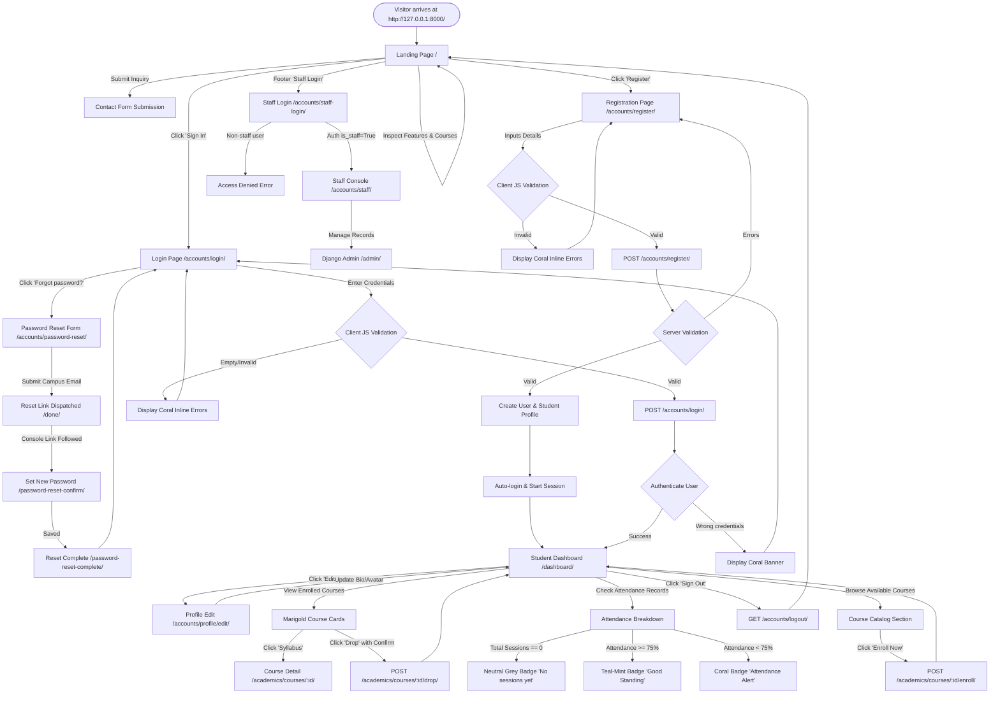
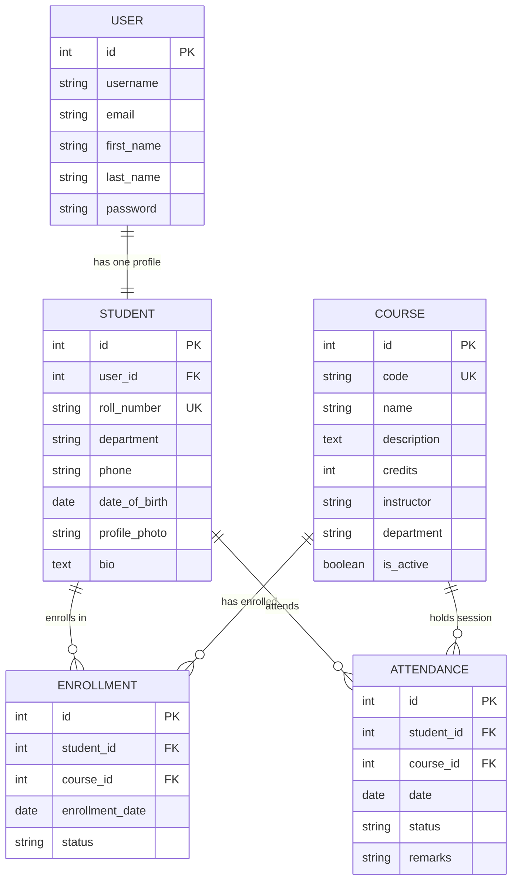

# CampusPulse — Complete Website Flow & Architecture

This document provides a comprehensive breakdown of the application flow, user journeys, navigation state machine, and data lifecycle for the **CampusPulse Student Portal**.

---

## 1. High-Level Flowchart (Mermaid)

---

## 2. Route & Navigation Map

| Route Path | View Function | Template | Access Level | Description |
|---|---|---|---|---|
| `/` | `landing_view` | `landing.html` | Public | Layered mesh gradient hero, floating glass live stat card, feature teasers, and CTA banner. |
| `/about/` | `about_view` | `about.html` | Public | Institutional mission, the 75% attendance standard, and academic department directory. |
| `/features/` | `features_view` | `features.html` | Public | Six comprehensive capability pillars with icons, descriptions, and architecture tags. |
| `/contact/` | `contact_view` | `contact.html` | Public | Validated inquiry form, registrar office hours, and physical campus location. |
| `/accounts/login/` | `login_view` | `accounts/login.html` | Public | Centered auth card with identifier & password fields, forgot password link. |
| `/accounts/register/` | `register_view` | `accounts/register.html` | Public | Centered card for student profile registration with client validation. |
| `/accounts/staff-login/` (or `/staff-login/`) | `staff_login_view` | `accounts/staff_login.html` | Public | Dedicated branded login gateway strictly for academic faculty and staff (`staff_login`). |
| `/accounts/staff/` (or `/staff/`) | `staff_dashboard_view` | `accounts/staff_dashboard.html` | Staff Only | Operational console displaying metrics and links to Django Admin tools (`staff_dashboard`). |
| `/accounts/password-reset/` | `PasswordResetView` | `accounts/password_reset_form.html` | Public | Request password recovery email. |
| `/accounts/password-reset/done/` | `PasswordResetDoneView` | `accounts/password_reset_done.html` | Public | Confirmation that reset link was dispatched. |
| `/accounts/password-reset-confirm/<uid>/<token>/` | `PasswordResetConfirmView` | `accounts/password_reset_confirm.html` | Public | Set new account password. |
| `/accounts/password-reset-complete/` | `PasswordResetCompleteView` | `accounts/password_reset_complete.html` | Public | Password successfully reset notification. |
| `/accounts/logout/` | `logout_view` | Redirects to `/` | Authenticated | Clears user session and displays a logout message. |
| `/accounts/profile/edit/` | `profile_update_view` | `accounts/profile_edit.html` | Student / Auth | Update phone, bio, department, and profile avatar image. |
| `/dashboard/` | `dashboard_view` | `dashboard/dashboard.html` | Student / Auth | Main portal: sidebar, profile card, course chips, attendance stats, and catalog. |
| `/academics/courses/` | `course_list_view` | `academics/course_list.html` | Student / Auth | Full campus course catalog with active enrollment indicators. |
| `/academics/courses/<id>/` | `course_detail_view` | `academics/course_detail.html` | Student / Auth | Course syllabus, instructor info, and personal attendance history. |
| `/academics/courses/<id>/enroll/`| `course_enroll_view` | Redirects to `/dashboard/` | Student / Auth (POST Only) | POST-only CSRF protected enrollment. |
| `/academics/courses/<id>/drop/` | `course_drop_view` | Redirects to `/dashboard/` | Student / Auth (POST Only) | POST-only CSRF protected drop with client confirmation. |
| `/admin/` | `admin.site.urls` | Admin templates | Staff / Admin | Administrative backend for managing courses, attendance, and users. |

---

## 3. Step-by-Step User Journeys

### Journey 1: Public Visitor Experience
1. **Landing on `/`:**
   - Visitor sees the global sticky top navbar (`CampusPulse` brand logo on the left, routed navigation links for Home, About, Features, Courses, Contact, and "Sign In" / "Register" buttons).
   - **Layered Gradient Hero Section:** Indigo-plum (`#3D2C7A`) into deep violet (`#2A1F5C`) mesh with softly blurred marigold and teal CSS depth blobs.
   - **Floating Glass Stat Card:** Semi-transparent glass card (`backdrop-filter: blur(18px)`) showing real-time live database statistics (Active Students, Enrolled Courses, Attendance Logs, &ge;75% Standing Threshold) with a smooth entrance animation.
   - **Feature Highlights Teaser:** 3 punchy cards highlighting attendance intelligence, course management, and student identity, with "Learn more" links pointing to `/features/`.
   - **Closing CTA Banner:** High-contrast invitation to create an account or sign in.
   - **Global Footer:** Deep indigo-plum background with complete portal links, resources, policies, and prominent **"Staff Login"** link resolving to ``.

2. **Exploring Dedicated Pages (`/about/`, `/features/`, `/contact/`):**
   - **`/about/`**: Explains institutional background, academic governance, and the rationale for the 75% attendance policy.
   - **`/features/`**: Explores all six architectural capabilities in depth.
   - **`/contact/`**: Fully validated inquiry form with real-time feedback, registrar office hours, and physical campus location.

---

### Journey 2: Student Registration Flow
1. **Navigating to `/accounts/register/`:**
   - User is presented with a centered card on the pale-mist background (`#F4F7FB`).
2. **Form Interaction & Client-Side Validation (`validation.js`):**
   - As the user types or moves between fields, inputs validate instantly:
     - **Username:** Alphanumeric check ($\ge 3$ characters).
     - **Email:** RFC-compliant regex pattern.
     - **Roll Number:** Verified format (e.g. `STU-2026-0042`).
     - **Password:** Minimum 8 characters.
     - **Confirm Password:** Real-time matching check against password.
   - Invalid fields immediately show a **coral inline error** (`#FF6B5E`) underneath. Submission is blocked until all fields are valid.
3. **Server-Side Processing (`accounts.views.register_view`):**
   - Django forms re-validate uniqueness (username, email, roll number).
   - Creates a standard Django `User` with cryptographically hashed password (`make_password`).
   - Creates the linked `Student` model instance (`OneToOneField`).
   - Automatically logs in the user (`django.contrib.auth.login`) and redirects to `/dashboard/` with a success message banner.

---

### Journey 3: Student Login Flow
1. **Navigating to `/accounts/login/`:**
   - Centered card (`max-width: 440px`) featuring a branded graduation cap badge.
   - Supports login via either **username** or **campus email**.
   - Includes one-click test credentials (`alex_morgan` / `student123!`).
2. **Authentication:**
   - On valid credentials: creates session cookie (`sessionid`) and redirects to `/dashboard/` (or intended target if intercepted by `?next=...`).
   - On invalid credentials: displays a clear coral error banner without exposing sensitive account info.

---

### Journey 4: The Student Dashboard Lifecycle (`/dashboard/`)
Once logged in, the student interacts with the core portal:

1. **Left Sidebar Navigation (`#3D2C7A` indigo-plum):**
   - Fixed desktop navigation bar with links: Overview, My Profile, Enrolled Courses, Attendance Records, and Course Catalog.
   - Mobile-responsive hamburger drawer (`dashboard.js`) that slides out and closes on outside click or Escape key.
2. **Top Profile Card:**
   - Displays avatar (uploaded image or initials circle), full name, roll number, department, email, phone, and academic bio.
   - Provides a direct link to `/accounts/profile/edit/`.
3. **Stat Metric Cards:**
   - **Enrolled Courses Count:** e.g., 4 active courses.
   - **Term Attendance Percentage:** Calculated aggregate with functional status badge.
   - **Active Credits:** Sum of credit hours for currently active courses.
4. **Enrolled Courses (Marigold Accented):**
   - Displayed as cards with marigold course code chips (e.g., `CS101`, `WEB301`), instructor name, and syllabus preview.
   - Each course shows a **functional status badge**:
     - **Teal-Mint (`#1FB6A6`):** If attendance is $\ge 75\%$ ("Good Standing").
     - **Coral (`#FF6B5E`):** If attendance is $< 75\%$ ("Attendance Alert").
   - Action buttons: "Syllabus" (opens `/academics/courses/<id>/`) or "Drop" (confirms and marks status as dropped).
5. **Attendance Breakdown Table:**
   - Real-time tabular calculation: Total Sessions, Attended Sessions, Absent count, Attendance Progress Bar, and Standing Status.
6. **Recent Attendance Log:**
   - Detailed log of past lecture sessions with dates and status (`Present`, `Late Arrival`, `Absent`).
7. **Available Courses to Enroll:**
   - Displays term courses the student is not yet enrolled in.
   - Clicking "Enroll Now" triggers `/academics/courses/<id>/enroll/` and immediately refreshes the dashboard with the newly enrolled course and credits updated.

---

### Journey 5: Faculty & Administrative Oversight (`/admin/`)
1. **Accessing `/admin/`:**
   - Staff/Admin log in with `admin` / `adminpassword123`.
2. **Operations:**
   - **Students:** Filter by department, search by roll number or name.
   - **Courses:** Manage course codes, credit weights, and instructors. Includes inline enrollment viewer.
   - **Attendance:** Mark attendance for lecture dates (`Present`, `Late`, `Absent`), add remarks, and view date hierarchies.
   - Changes made in the admin immediately update the student's dashboard calculations in real-time.

---

## 4. Data Entity Relationship Model (ERD)

---

## 5. Attendance Calculation Algorithm

For any course enrolled by a student:
$$\text{Attended Sessions} = \text{Count}(\text{status} \in \{\text{'present'}, \text{'late'}\})$$
$$\text{Total Sessions} = \text{Count}(\text{all attendance records for course \& student})$$
$$\text{Attendance Percentage} = \begin{cases} 
\left(\frac{\text{Attended Sessions}}{\text{Total Sessions}}\right) \times 100 & \text{if } \text{Total Sessions} > 0 \\
\text{None (No sessions yet)} & \text{if } \text{Total Sessions} = 0 
\end{cases}$$

- If $\text{Total Sessions} = 0$: Display **No sessions yet** badge using neutral slate styling (`.badge-neutral` / `#64748B`). Does not claim 100% or "Good Standing".
- If $\text{Attendance Percentage} \ge 75.0\%$: Apply **Teal-Mint** token (`--color-accent-attendance: #1FB6A6`) &rarr; **Good Standing**.
- If $\text{Attendance Percentage} < 75.0\%$: Apply **Coral** token (`--color-accent-alert: #FF6B5E`) &rarr; **Attendance Alert**.
